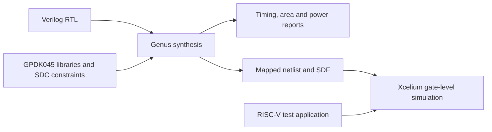

# biRISC-V RTL Optimization — ALU and Shifter

**An RTL optimization case study focused on improving the timing of a 32-bit, dual-issue RISC-V processor.**

This fork explores changes to the biRISC-V ALU and shift logic with the goal of increasing the circuit's maximum operating frequency. My contribution focuses on adapting the ALU/shifter RTL within an existing processor and synthesis project, then examining the implementation in the context of synthesis and simulation evidence.

**Focus:** Verilog RTL · combinational logic · logic synthesis · static timing analysis  
**Environment in the current scripts:** Cadence Genus · GPDK045 · Cadence Xcelium/SimVision

[RTL changes](#rtl-changes) · [Results and evidence](#results-and-evidence) · [Reproduction](#reproduction) · [Credits](#credits)

## Project at a glance

| Question | Summary |
| --- | --- |
| What was the engineering goal? | Explore ALU/shifter changes to improve timing and pursue a higher operating frequency. |
| What was my contribution? | Adaptation of the ALU and its shift operations in this fork. |
| What changed? | Explicit conditional shift stages were expressed using Verilog shift operators, with signed handling for arithmetic right shift. |
| What evidence is available? | The RTL and its history, an archived 170 MHz synthesis report set, and an existing gate-level simulation image. |
| What remains unverified? | A matched before/after measurement establishing the frequency or area improvement attributable to this ALU change. |

## Engineering context

[biRISC-V](https://github.com/ultraembedded/biriscv) is Ultra-Embedded's 32-bit, dual-issue RISC-V core. This repository builds on [João Pedro Buzatti Mendes's logic-synthesis project](https://github.com/joaopedrobuzattim/logic-synthesis-biriscv), which supplied the starting point for this fork.

The archived timing report identifies a path from a frontend decode FIFO register to an execution result register, passing through ALU logic. That makes the execution datapath a useful place to investigate timing. It does not establish that the shifter alone limits frequency: optimization must be assessed on the mapped design and its complete critical path.

The current synthesis scripts target **GPDK045 with Cadence Genus**. IBM 180 and RTL Compiler belong to the earlier project context; they do not describe the current scripts.

## RTL changes

My work centers on [`biriscv_alu.v`](src/core/biriscv_alu.v). The ALU remains combinational and retains its operation, operand, and result ports.

### From explicit shift stages to operators

The earlier implementation expressed variable shifts through conditional stages for shifts of 1, 2, 4, 8, and 16 bits. For example, the first two left-shift stages were:

```verilog
// Excerpt from the earlier ALU implementation.
if (alu_b_i[0] == 1'b1)
    shift_left_1_r = {alu_a_i[30:0],1'b0};
else
    shift_left_1_r = alu_a_i;

if (alu_b_i[1] == 1'b1)
    shift_left_2_r = {shift_left_1_r[29:0],2'b00};
else
    shift_left_2_r = shift_left_1_r;
```

The current ALU uses these expressions in the corresponding operation branches:

```verilog
// Declaration used by arithmetic right shift.
wire signed [31:0] alu_a_signed = alu_a_r;

// Separate case branches in the ALU:
result_r = alu_a_r << alu_b_r[4:0];         // Left shift
result_r = alu_a_r >> alu_b_r[4:0];         // Logical right shift
result_r = alu_a_signed >>> alu_b_r[4:0];   // Arithmetic right shift
```

Using the lower five bits bounds the shift amount to 0–31 for a 32-bit operand. The signed operand makes the arithmetic right shift propagate the sign bit. The intermediate `reg` variables in the earlier combinational implementation were not clocked pipeline registers; removing them is not evidence of a flip-flop reduction.

This representation lets synthesis map the shift operations under the selected library and constraints. **Operator syntax alone does not guarantee a faster circuit or a different physical shifter topology.** The earlier staged implementation can also synthesize to a barrel shifter.

See the [earlier ALU snapshot](https://github.com/Douglasmartinsf/logic-synthesis-biriscv/blob/8430e6de10a636354dba8071c2dc85a3e5f0a999/src/core/biriscv_alu.v) and the [integration commit](https://github.com/Douglasmartinsf/logic-synthesis-biriscv/commit/58388e002039f779e2678296b7f4321d86541874) for implementation context. This fork also contains collaborators' work and earlier experiments; those changes are not all attributed to this ALU contribution.

## Evaluation flow



The flow separates two questions: whether the mapped circuit meets a timing constraint, and whether a test application behaves as expected in simulation. A passing timing report is not a functional verification result or a measurement of application throughput.

## Results and evidence

The published report set is stored under [`baseline/170_MHz/WORST`](synthesis/reports_versions/baseline/170_MHz/WORST). It was generated by **Genus 21.19-s055_1 on December 2, 2025**.

| Archived synthesis metric | Reported value | Source |
| --- | --- | --- |
| Run label / target | 170 MHz | [Report directory](synthesis/reports_versions/baseline/170_MHz/WORST) |
| Clock period | 5,880 ps = 5.88 ns | [Timing](synthesis/reports_versions/baseline/170_MHz/WORST/riscv_core_timing.rpt) |
| Critical-path setup slack | 0 ps, reported as MET | [Timing](synthesis/reports_versions/baseline/170_MHz/WORST/riscv_core_timing.rpt) |
| Violating paths / total negative slack | 0 / 0 | [QoR](synthesis/reports_versions/baseline/170_MHz/WORST/riscv_core_qor.rpt) |
| Leaf instances | 26,708 | [QoR](synthesis/reports_versions/baseline/170_MHz/WORST/riscv_core_qor.rpt) |
| Sequential / combinational instances | 2,870 / 23,838 | [QoR](synthesis/reports_versions/baseline/170_MHz/WORST/riscv_core_qor.rpt) |

**Interpretation:** this archived run met its reported setup constraint with zero reported margin. The folder is labeled `baseline`, but the archive does not identify the exact RTL revision used. It is a reference result, not a verified before/after comparison or proof of the current ALU's maximum frequency. These are synthesis-stage results, not post-route or silicon measurements.

Three frequency references must be kept separate:

| Reference | Evidence status |
| --- | --- |
| **170 MHz** | The report set above is available for inspection. |
| **185 MHz** | The current [testbench](tb/tb_core_icarus/tb_top.v) contains this clock setting and a matching fixed SDF directory. A configured testbench does not prove timing closure. |
| **190 MHz** | A [historical commit](https://github.com/Douglasmartinsf/logic-synthesis-biriscv/commit/9277d29975fc4d6d4b83ca0d0025959fd54ada8f) records this result alongside pipeline changes. Its corresponding report set is not published in the current tree, so it is not used here to claim an improvement. |

The [evidence index](synthesis/reports_versions/README.md) also documents area and power values, their provenance, and the limitations of comparing runs.

### Existing simulation illustration


*Image inherited from the project's Bubble Sort gate-level simulation documentation. Its associated RTL revision, frequency, and run logs are not established here; it illustrates the workflow rather than validating this fork's ALU changes.*

## Reproduction

Start with the [synthesis and simulation guide](synthesis/README.md). It documents the current commands, tool requirements, parameters, and manual alignment needed for the simulation setup.

- **Inspect the work:** source code, constraints, and archived reports are available without running Cadence tools.
- **Run synthesis:** requires a Linux environment, licensed Cadence Genus, and a local GPDK045 installation with the expected libraries.
- **Run simulation:** requires the relevant simulator setup, test application, and, for gate-level simulation, matching generated netlist, SDF, and cell models.

The execution setup retains environment-specific paths and fixed simulation settings. The guide identifies these requirements; the repository is not presented as a turnkey reproduction of the archived run.

## Repository map

| Location | Purpose |
| --- | --- |
| [`src/core/biriscv_alu.v`](src/core/biriscv_alu.v) | ALU and shift operations highlighted in this case study |
| [`src/core`](src/core) | Processor RTL and integration |
| [`synthesis/scripts`](synthesis/scripts) / [`synthesis/constraints`](synthesis/constraints) | Genus flow, library setup, and SDC constraints |
| [`synthesis/reports_versions`](synthesis/reports_versions) | Archived measurements and evidence notes |
| [`tb/tb_core_icarus`](tb/tb_core_icarus) | Testbench and simulation support files |
| [`riscv-app-gen`](riscv-app-gen) | RISC-V application sources and build rules |

## Credits

- **Douglas Figueiró:** ALU/shifter adaptation highlighted in this portfolio case study.
- **Ultra-Embedded:** original [biRISC-V processor](https://github.com/ultraembedded/biriscv).
- **João Pedro Buzatti Mendes:** [parent synthesis project](https://github.com/joaopedrobuzattim/logic-synthesis-biriscv) and prior project work. The fork's [integration history](https://github.com/Douglasmartinsf/logic-synthesis-biriscv/commit/6b7c9803d6d4d0f3770557e8c77fa719a04262fb) also records merged collaborator optimizations.
- **Professor Mateus Beck:** scripts and technology setup credited by the earlier academic project.
- **Google RISCV-DV:** linker script provenance recorded by the earlier project.

The original core and inherited project contributions retain their attribution. See [LICENSE](LICENSE) for the repository's Apache 2.0 license.
